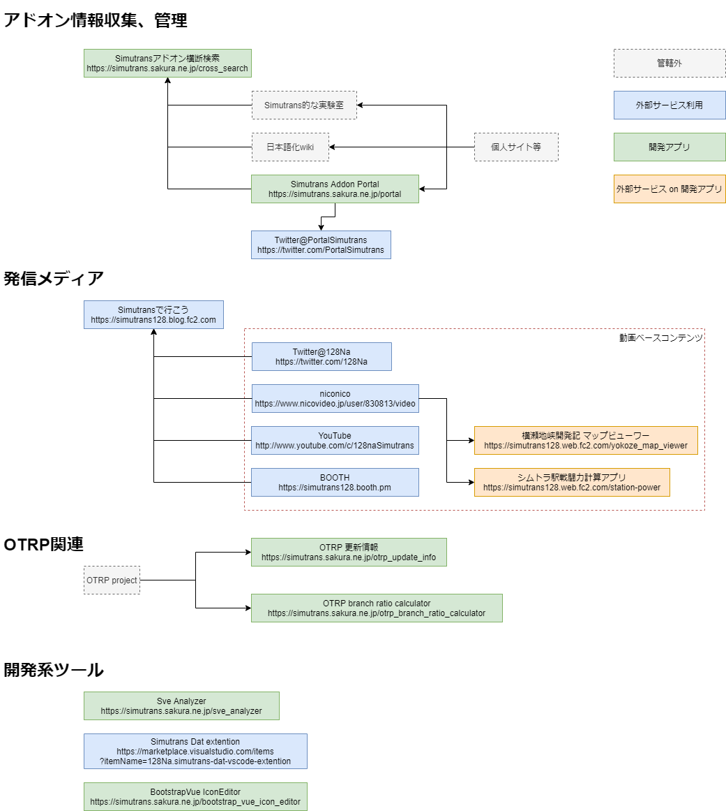

# 管理サイト関係図

# links

## アドオン情報収集、管理
### Simutransアドオン横断検索
https://simutrans.sakura.ne.jp/cross_search/
### Simutrans Addon Portal
https://simutrans.sakura.ne.jp/portal/
### Twitter@PortalSimutrans
https://twitter.com/PortalSimutrans

## 発信メディア
### Simutransで行こう
https://simutrans128.blog.fc2.com/
### Twitter@128Na
https://twitter.com/128Na
### niconico
https://www.nicovideo.jp/user/830813/video
### YouTube
http://www.youtube.com/c/128naSimutrans
### BOOTH
https://simutrans128.booth.pm/
### 横瀬地峡開発記 マップビューワー
https://simutrans128.web.fc2.com/yokoze_map_viewer/
### シムトラ駅戦闘力計算アプリ
https://simutrans128.web.fc2.com/station-power/

## OTRP関連
### OTRP 更新情報
https://simutrans.sakura.ne.jp/otrp_update_info/
### OTRP branch ratio calculator
https://simutrans.sakura.ne.jp/otrp_branch_ratio_calculator/

## 開発系ツール
### Simutrans Dat extention
https://marketplace.visualstudio.com/items?itemName=128Na.simutrans-dat-vscode-extention
###  BootstrapVue IconEditor
https://simutrans.sakura.ne.jp/bootstrap_vue_icon_editor/